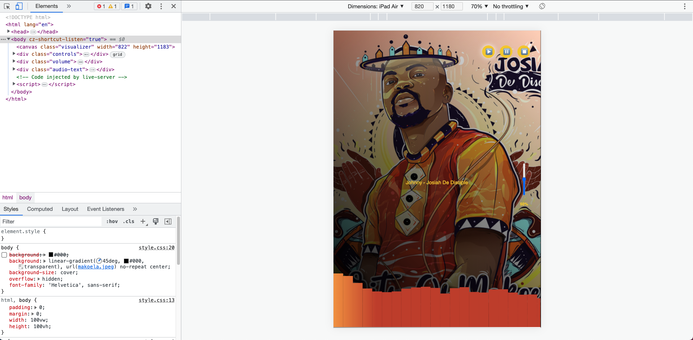

# Web Audio Api Fun
Learning to create visuals using canvas and using the audio context API to render canvas bars based on the audio source buffer

Using ES6 Javascript ES6 classes, I managed to create a simple audio visualizer using HTML5 Canvas and Audio/AudioContext



```javascript
    window.addEventListener('DOMContentLoaded', () => {
        new AudioVisuals('Johnny.mp3','Johnny - Josiah De Disciple');
    });

    class AudioVisuals {
        ...
    }
```

You can watch the videos of watch I managed to achieve with the tools mentioned above.

[Video 1](https://host.phylls.org/videos/Web-Audio-Player.mp4)
[Video 2](https://host.phylls.org/videos/surfin-on-sine-wave.mp4)

PS - downloadd your own mp3 files and change parameters to see the effect